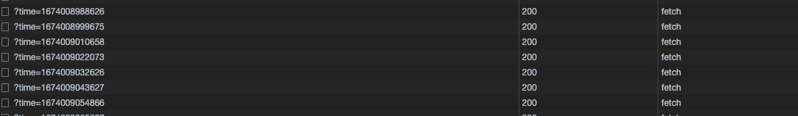

How redeployment notifies users to refresh the web page

Sometimes after going online, the user still stays on theold page. The user does not know that the webpage has been re-deployed. When jumping to the page, sometimes the hash of the js connection changes, resulting in an error report and the user cannot experience the new function.

The solution is to judge according to the hash value of the script src generated after packaging. Each packaging will generate a unique hash value. As long as the polling is different, it must be re-deployed.

## User Guide

### install

#### npm

```shell
npm install --save html-check-update 
```

#### pnpm

```shell
pnpm install --save html-check-update 
```

#### yarn

```shell
yarn add html-check-update 
```

## Example

Join at the entry of the project

```js
import { HtmlCheckUpdate } from 'html-check-update'

new HtmlCheckUpdate({delay: 10000, confirm: () => true })
```

### delay - number

The interval between each check

### confirm - function

default: window.confirm

To customize the prompt interaction, the return value of the prompt interaction interface must be a Boolean type


